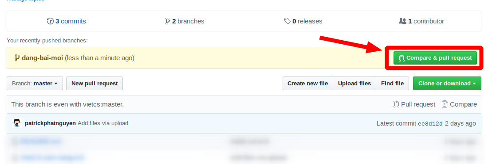
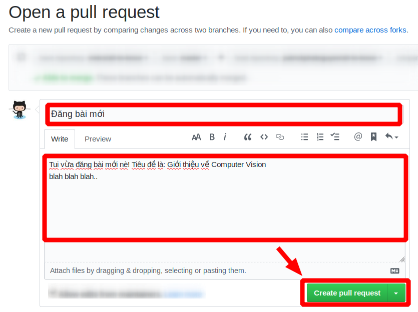

[TOC]

# Quy định chung

## Quy định về hình thức 

- Thời lượng đọc: lý tưởng là từ 5 đến 8 phút.

- Một đoạn văn tối đa 4 câu là phải xuống dòng

- Số hình tối thiểu: mỗi mục nhỏ ít nhất 1 tấm hình.

- Nội dung của các đề mục phải liên kết với nhau.

- Ngôn ngữ: **tiếng Việt**, sử dụng các thuật ngữ tiếng Anh. Tuy nhiên cố gắng dịch trừ khi sử dụng từ tiếng Việt mang cảm giác gượng.

  

## Quy định về chất lượng

- Số người review: ít nhất 3 người review và 50% trở lên đồng ý.
- Một số thứ nên có:
  - Nên viết theo kiểu quy nạp (top-down) sẽ đỡ buồn ngủ hơn
  - Hiệu ứng "Ồ quao": Bài viết nên có yếu tố lạ, bất ngờ
  - Nên đặt các câu hỏi thảo luận: Cái gì, tại sao, khi nào?
- Triết lý khi viết bài: 
  - Viết để học, viết để thảo luận, viết để khám phá những "miền đất" mới :))
  - Không viết vì tiền

# Hướng dẫn đăng bài

## Cài đặt

**Bước 0:** Tại và cài đặt [git](https://git-scm.com/downloads)

**Bước 1:** Tải và cài đặt Hugo trên máy

Truy cập github's [releases](https://github.com/gohugoio/hugo/releases) của hugo **v0.58++**. Tải bản **hugo_extended** (phải là bản extended!) phiên bản mới nhất (đuôi .deb hoặc .tar.gz). Sau đó có thể nhấn vào để cài trên GUI **hoặc** có thể cài thông qua terminal:

```bash
TEMP_DEB="$(mktemp)" &&
wget -O "$TEMP_DEB" 'duong-dan-hugo-file.deb' &&
sudo dpkg -i "$TEMP_DEB"
rm -f "$TEMP_DEB"
```

> **Lưu ý:** Từ bước này trở đi nếu chưa hiểu thì có thể coi [clip sau](https://www.youtube.com/watch?v=rgbCcBNZcdQ&t)

Bước 2:** Fork [repo](https://github.com/vietcs/vietcs-blog) của VietCS


Giờ bạn đã có 1 bản fork trên github của bạn!


**Bước 2:** Clone bản fork này về máy

Copy quả link ở đây:


Clone về máy

```bash 
git clone <thay bằng link của bạn>
cd vietcs-blog
git submodule update --init --recursive
```

**Bước 3:** Tải công cụ viết markdown: vscode,... Nhưng khuyến khích nên dùng typora, download [tại đây](https://www.typora.io/) vì đơn giản cho người mới, giao diện đẹp người dùng lâu cũng thấy thoải mái.

**Bước 4:** Tạo một **branch** mới để bạn có thể thay đổi trên branch này

```bash 
git checkout -b viet-bai-moi
```

## Đăng bài

**Bước 5:** Tạo file markdown và chuẩn bị viết bài!

 ```bash
hugo new <chủ-đề>/<tên-file>.md
 ```

Hiện nay có 1 số chủ đề:

- computer vision "cổ điển" : `cv`
- computer vision "hiện đại" : `mcv`
- công nghệ đóng gói: `tech`
- toán cho CS: `math`

Ví dụ: Bạn viết 1 bài về gioi-thieu-cv về chủ đề Computer Vision 

```bash
hugo new cv/gioi-thieu-cv.md
```

**Bước 6:** Mỗi 1 bài viết có 1 header, điều chỉnh header của file bài viết sao cho phù hợp. Header tiêu chuẩn sẽ trông như thế 

```md
---
title: "Bạn biết gì về Computer Vision?"
date: 2019-10-13T13:34:08+07:00
draft: false
authors: ["phatnt"]
categories:
  - computer vision
tags:
  - introductory
  - vision
slug: computer-vision-la-gi
---
```

Trong đó:

`date` ngày viết

`authors` các tác giả cùng viết bài viết (Nếu bạn chưa có tên viết tắt thì thông báo cho **web owner**)

`categories` chủ đề của bài viết

`tags` đính kèm của bài viết

`slug` link dẫn tới bài viết, có dạng `vietcs/posts/../<slug>`

**Bước 7: **Review xem trước trang web tại local, xem bài của bạn hiện lên trang như thế nào

```bash
hugo serve
```

**Bước 8:** Commit bài lên github

```bash
git add <đường dẫn tới file markdown mà bạn viết>
git commit -m "Dang bai moi: <ten post>"
git push origin viet-bai-moi
```

**Bước 9:** Lên nhìn lại bản repo fork trên github của bạn

Github sẽ tự hiểu là bạn vừa thay đổi trên **branch** viet-bai-moi này, và gợi ý bạn làm 1 **pull request** để xin mình **merge** vào **master branch** của **web repo**



Bạn đăng 1 cái **pull request** với tựa đề và nội dung cụ thể, như trong hình chẳng hạn. Rồi mình và các bạn khác sẽ theo dõi và sẽ merge những thay đổi trên vào **master branch** của **web repo**



**Bước 10:** Báo cho **Web Owner** để duyệt bài và **commit** vào **master branch** của web repo

## Đồng bộ repo

Bởi vì bạn dùng bản "fork" của repo của vietcs-blog, sẽ tới một lúc bản của bạn sẽ bị outdated trong khi vietcs-blog đã cập nhật bản mới. Để đồng bộ với repo của vietcs, bạn phải:

- Thêm remote upstream tới github của repo gốc

```bash
git remote add upstream https://github.com/vietcs/vietcs-blog
```

- Khi cần đồng bộ,   bạn sẽ kéo repo gốc (upstream) xuống

```bash 
git pull upstream master
```

# Hướng dẫn sử dụng markdown

Đọc bài này: https://viblo.asia/helps/cach-su-dung-markdown-bxjvZYnwkJZ

**Và** đơn giản chỉ cần [cài typora](https://www.typora.io/) xài cho dễ

## HTML trong markdown

Bạn chỉ cần nhớ một số thứ sau đây

"1." hay "2." hay "3." là header bậc 1 dùng #
"1.1" hay "1.2" hay "2.1" là header bậc 2 dùng ##
"1.1.1" hay "1.1.2" hay "2.1.2" là header bậc 3 dùng ###

## Đầu đề (header)
```md
# 1
## 2.1
### 2.1.1
```
**Kết quả**

# 1
## 2.1
### 2.1.1


### Kiểu chữ

| HTML                  | Kết quả             |
| --------------------- | ------------------- |
| `<b> in đậm </b>`     | <b> in đậm </b>     |
| `<i> in nghiêng </i>` | <i> in nghiêng </i> |

### Căn lề giữa

```html
<center> Chữ này ở giữa</center>
```

**Kết quả**:


<center>Chữ này ở giữa</center>
### Hình ảnh

```html

```

Tham số gồm

 **src:** dẫn đường link tới bức ảnh

**width:** chiều rộng của bức ảnh

**height:** chiều cao của bức ảnh


### Đính kèm ảnh trong khi viết bài

```html
<center></center>
<center> <b>Ảnh 1</b> Minh họa Object Detection - <i>towardsdatascience </i></center>
```

Lưu ý: Ảnh nên có width từ 300 -> 400 và không nên dài hơn chữ quá 

**Kết quả:**

<center></center>
<center> <b>Ảnh 1</b> Minh họa Object Detection - <i>towardsdatascience </i></center>
## Gõ công thức toán trong Markdown

Để gõ được công thức toán trong markdown, bạn phải dùng một extension của Markdown là Latex. Đọc tại [đây](https://texmath.com/soan-thao-toan-hoc-trong-latex/)

Lưu ý rằng, khi viết latex cùng với markdown, latex sẽ được giới hạn trong phạm vi 2 dấu đồng đôla "$".

Ví dụ: $a+b=c$

# Các thông tin liên hệ

- Thầy Nguyễn Vinh Tiệp: Mentor cho VietCS, hỏi mảng nào thầy cũng chơi

- Nguyễn Trường Phát: Viết bài Computer Vision & Web Owner của VietCS

- Hồ Sỹ Tuyến: Viết bài về Computer Vision & Generative Models
- Lê Thanh Phước Hiếu: Viết bài về các mảng Toán
